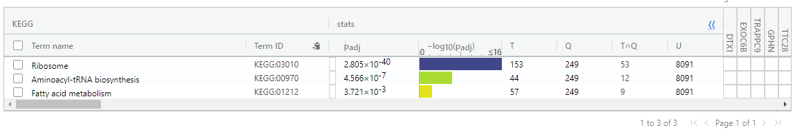

# Assignment 2: Differential Gene Expression and Preliminary ORA

## Introduction
In assignment 1, we have downloaded the supplementary data of the dataset [GSE224681](https://www.ncbi.nlm.nih.gov/geo/query/acc.cgi?acc=GSE224681)[[1](https://www.frontiersin.org/articles/10.3389/fimmu.2023.1000497/full)] from GEO database.
The experiment of this dataset consists of treating tumor associated macrophages(TAMs) with cisplatin and comparing the induced expression changes with a control group. In this case, the experimental group would be TAMs that are treated with cisplatin, and the control group are TAMs that received no treatment.There are 3 replicates for each group.
In assignment 1, we have completed the pre-processing of the data, including the process of data cleaning and normalization, and the process of gene ID conversion.The initial data is a data frame of 6 columns(samples) and 63925 rows(genes).Using edgeR, we filter out any genes of total CPM < 3, which is the size of our smallest group of replicates.We filter out 50690 uninformative features, and 13235 features are left.Then we remove the Ensemble gene IDs which are not able to be mapped to the symbol IDs and map from Ensemble IDs to HUGO symbols for each feature.We merge multiple Ensemble gene IDs corresponding to one symbol ID by taking the sum.The final data is a data frame of 6 columns and 12226 rows, with unique HUGO identifiers as rownames.In this assignment, we will use this data for the next work.
Now let's load the data from the assignment 1.
```{r message=FALSE}
load("./data_preprocessing.Rdata")
```
Here are the first 10 rows of the data frame:
```{r message=FALSE}
head(mapped_data,10)
```
<center>Table 1 The first 10 rows of the data frame</center>

## Differential Gene Expression
We have defined noCisplatin and cisplatin as the groups of samples.
```{r message=FALSE}
samples
```
<center>Table 2 The group information of samples</center>

We aim to look for genes that are significantly up- or down-regulated in the samples with cisplatin treatment compared to the samples without cisplatin treatment.
Here are MDS plots of data, pre- and post-normalization:
```{r message=FALSE}
limma::plotMDS(filtered_data, labels=rownames(samples), col=c("red","blue")[factor(samples$Treatment)], main="Sample feature clustering, pre-normalization")
```
<center>Figure 1 Sample feature clustering, pre-normalization</center>
```{r message=FALSE}
limma::plotMDS(d, labels=rownames(samples), col=c("red","blue")[factor(samples$Treatment)], main="Sample feature clustering, post-normalization")
```
<center>Figure 2 Sample feature clustering, post-normalization</center>

The neat clustering with respect to treatment type justifies the usage of Treatment as our principal factor.
Based on this, the results of our analysis would be good.
Now we use DESeq2[[2](https://bioconductor.org/packages/release/bioc/html/DESeq2.html)] to construct our model and run the differential analysis.
```{r message=FALSE, warning=FALSE}
if(!require("DESeq2")){
  BiocManager::install("DESeq2")
}

# group information
group = factor(samples$Treatment, levels = c("cisplatin", "noCisplatin"))

# sample information
colData <- data.frame(row.names = colnames(mapped_data),
                      condition = group)
# construct DESeqDataSet
dds <- DESeqDataSetFromMatrix(countData = mapped_data,
                              colData = colData,
                              design = ~ condition)
# differential analysis
dds <- DESeq(dds)
# normalized_exp <- as.data.frame(counts(dds, normalized=TRUE))

# get the DESeqResults
res <- results(dds, contrast = c("condition", levels(group)))
# sort the results by p-value
resOrdered <- res[order(res$pvalue),]
# transform the DESeqResults to a data frame
DEG <- as.data.frame(resOrdered)
DEG <- na.omit(DEG)
# get the first 10 rows of the results
head(DEG,10)
```
<center>Table 3 The first 10 rows of the results of DESeq2</center>

```{r message=FALSE, warning=FALSE}
# How many genes have p < 0.05?
length(which(DEG$pvalue < 0.05))
```

```{r message=FALSE, warning=FALSE}
# How many genes have padj < 0.05?
length(which(DEG$padj < 0.05))
```

I use the multiple hypothesis correction method, Benjamini-Hochberg, to correct my p-values.This method is a built-in default method of DESeq2. The the threshold of p-value and adjusted p-value are both set at <0.05, which has been the standard in most areas of statistical testing.
According to the result of DESeq2, 2218 genes pass the threshold p-value, but after adjustment, 893 genes are left.
We conclude that these 893 genes are my significantly differentially expressed genes. Get a separate list of up and down regulated genes.

```{r message=FALSE, warning=FALSE}
de_genes <- DEG[DEG$padj < 0.05, ]
# Up regulated genes.
upreg_genes <- de_genes[de_genes$log2FoldChange > 0, ]
# How many?
nrow(upreg_genes)
```

```{r message=FALSE, warning=FALSE}
# Down regulated genes.
downreg_genes <- de_genes[de_genes$log2FoldChange < 0, ]
# How many?
nrow(downreg_genes)
```
We uncover 432 up-regulated genes and 461 down-regulated genes in the samples with cisplatin treatment compared to the samples without cisplatin treatment.

Then we visualize the DEGs with a heatmap (pheatmap[[3](https://cran.r-project.org/web/packages/pheatmap/index.html)]) and a Vocalo plot.
```{r message=FALSE, warning=FALSE}
if(!require("pheatmap")){
  BiocManager::install("pheatmap")
}
if(!require("limma")){
  BiocManager::install("limma")
}
```

Heatmap:
```{r message=FALSE, warning=FALSE}
# Get top hits only
sig_names <- rownames(de_genes)
heatmap_matrix <- t(scale(t(mapped_data[sig_names, ])))

pheatmap(
  heatmap_matrix,
  show_rownames = F,
  show_colnames = T,
  cluster_rows = T,
  cluster_cols = T
)
```
<center>Figure 3 Heatmap of DEGs</center>
```{r message=FALSE, warning=FALSE}
dim(heatmap_matrix)
```
We see a significant differential expression of genes between samples with cisplatin treatment and without cisplatin treatment.

Vocalo plot:
```{r message=FALSE, warning=FALSE}
dat = DEG
dat$label <- rownames(dat)
dat$label[!(dat$padj < 0.05 & abs(dat$log2FoldChange) >= 1)] = NA

library(ggrepel) # Reference [4]
ggplot(dat,aes(log2FoldChange, -log10(padj)))+
  geom_hline(yintercept = -log10(0.05), linetype = "dashed", color = "#999999")+
  geom_vline(xintercept = c(0,0), linetype = "dashed", color = "#999999")+
  geom_point(aes(size=-log10(padj), color= -log10(padj)))+
  scale_color_gradientn(values = seq(0,1,0.2),
                        colors = c("#39489f","#39bbec","#f9ed36","#f38466","#b81f25"))+
  scale_size_continuous(range = c(1,3))+ xlim(c(-10,10))+
  theme_bw()+
  theme(panel.grid = element_blank())+
  geom_text_repel(
    data = dat,
    aes(label = label),
    size = 3,
    box.padding = unit(0.5, "lines"),
    point.padding = unit(0.8, "lines"), segment.color = "black", show.legend = FALSE )
```
<center>Figure 4 Vocalo plot of DEGs</center>

The dots above the horizontal dashed line represent genes that are significantly up- or down-regulated, and the size (large to small) and color of the dots (red to blue) represent the adjusted p-value from small to large.

## Thresholded Over-Representation Analysis
I choose g:Profiler[[5](https://biit.cs.ut.ee/gprofiler/gost)] to complete Thresholded Over-Representation Analysis.Because g:Profiler is easy (just copy and paste) and it has been used in previous assignments. And the results are easy to interpret.

For the next analysis, we need to prepare the gene lists.We export the above gene lists to three files, `de_genes.txt`(all DEGs), `upreg_genes.txt`(up-regulated genes only), `downreg_genes.txt`(down-regulated genes only).The we can easily copy-pasted these gene names of top hints into the website of g:Profiler[5].
```{r message=FALSE, warning=FALSE}
# export gene list of DEGs
write.table(rownames(upreg_genes), file = "./results/upreg_genes.txt", row.names = F, col.names = F, quote=F)
write.table(rownames(downreg_genes), file = "./results/downreg_genes.txt", row.names = F, col.names = F, quote=F)
write.table(rownames(de_genes), file = "./results/de_genes.txt", row.names = F, col.names = F, quote=F)
```

Then I copy the gene names from three gene list files and paste them into the query box of g:Profiler. Set the Organism option to "Homo sapiens(Human)", the Significance threshold to "Benjamini-Hochberg FDR" and the User threshold to 0.05.Select GO biological process(No electronic GO annotations), KEGG, Reactome, and WikiPathways as the data sources.According to the website of g:Profiler, the annotation data sources (KEGG, Reactome etc) are updated during the same update routine straight from the data sources.GO biological processes was last released on 2022-12-04, KEGG was was last released on 2022-12-26, Reactome was last released on 2022-12-28, and WikiPathways was last released on 2022-12-10.All annotation databases have been updated to the latest version. This would result in my good result.The original paper used KEGG, GO, Reactome and HALLMARK as the annotation sources.And We have practiced three data sources(GO biological processes, Reactome and WikiPathways) in our previous assignment.So I choose the annotation sources above.


For all DEGs, GO biological processes returned 302 results, KEGG returned 5 results, Reactome returned 54 results, and WikiPathways returnd 10 results.
Here are the screenshots of the results from g:Profiler for all DEGs, I only take the top 10 for those over 10 terms:


Same as the homework assignment, we then placed an arbitrary restriction on the term sizes of 5-200 to remove large pathways and focus on smaller, more local ones.All of the results have changed.

The number of terms of GO:BP change from 302 to 124:


The number of terms of KEGG change from 5 to 4:


The number of terms of Reactome change from 54 to 37:


The number of terms of WikiPathways change from 10 to 9:


### Upregulated genes only
Then we only input up-regulated genes into g:Profiler and place an arbitrary restriction on the term sizes of 5-200. We get 235 terms from GO:BP, 6 terms from KEGG, 5 terms from Reactome and 7 terms from WikiPathways.Compared to the gene list of all differentially expressed genes together, the number of terms from GO biological processes and KEGG have become more (111 terms more from GO:BP, 2 terms more from KEGG), and the number of terms from the other data sources have been less(32 terms less from Reactome, 2 terms less from WikiPathways).  

Here are the screenshots of results from g:Profiler for up-regulated genes only:


### Downregulated genes only
Next we only input down-regulated genes into g:Profiler and place an arbitrary restriction on the term sizes of 5-200. We get 39 terms from GO:BP, 9 terms from KEGG, 4 terms from Reactome and 6 terms from WikiPathways. Compared to the gene list of all differentially expressed genes together, the number of terms from GO biological processes and KEGG have become less (85 terms less from GO:BP, 1 terms less from KEGG), and the number of terms from Reactome has become more(9 terms more from Reactome).Only the number of the terms returned from WikiPathways remains consistent. 

Here are the screenshots of results from g:Profiler for down-regulated genes only:





## Interpretation
According to the original paper, they performed gene set enrichment analysis (GSEA) for up- and downregulated genes in cisplatin condition to evaluate pathway enrichment under cisplatin treatment.They choose the following databases REACTOM, KEGG, HALLMARK, GO as the annotation databases.The interferon alpha and gamma responses were the top upregulated pathways, along with p53 pathway, inflammatory response, IL-6 and TNFa signaling, epithelial-mesenchymal transition, endocytosis, hypoxia, KRAS signaling, DNA repair. The downregulated genes showed significant enrichment for Myc targets, cholesterol homeostasis, mTORC1 signaling, WNTbeta-catenin signaling[1].


In my results of Thresholded Over-Representation Analysis, the upregulated genes are also significantly enriched in p53 pathway, DNA repair pathway.The downregulated genes are significantly enriched in cholesterol metabolism related pathways. So I think my over-representation results support conclusions or mechanism discussed in the original paper.


## Reference
[1] LARIONOVA, Irina, et al. Tumor-associated macrophages respond to chemotherapy by detrimental transcriptional reprogramming and suppressing stabilin-1 mediated clearance of EGF. Frontiers in Immunology, 14: 543.

[2] Love MI, Huber W, Anders S (2014). “Moderated estimation of fold change and dispersion for RNA-seq data with DESeq2.” Genome Biology, 15, 550. doi: [10.1186/s13059-014-0550-8](https://genomebiology.biomedcentral.com/articles/10.1186/s13059-014-0550-8).

[3] Kolde R (2019). _pheatmap: Pretty Heatmaps_. R package version 1.0.12,<https://CRAN.R-project.org/package=pheatmap>.

[4] Slowikowski K (2023). _ggrepel: Automatically Position Non-Overlapping Text Labels with 'ggplot2'_. R package version 0.9.3, <https://CRAN.R-project.org/package=ggrepel>.

[5] Uku Raudvere, Liis Kolberg, Ivan Kuzmin, Tambet Arak, Priit Adler, Hedi Peterson, Jaak Vilo: g:Profiler: a web server for functional enrichment analysis and conversions of gene lists (2019 update) Nucleic Acids Research 2019; doi:[10.1093/nar/gkz369](https://doi.org/10.1093/nar/gkz369)
