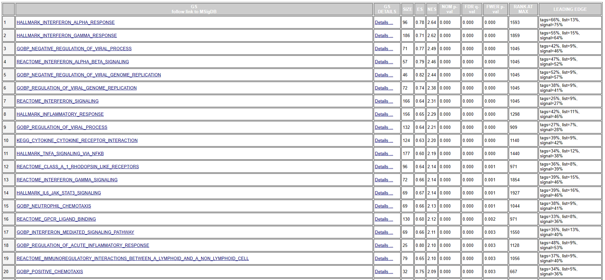
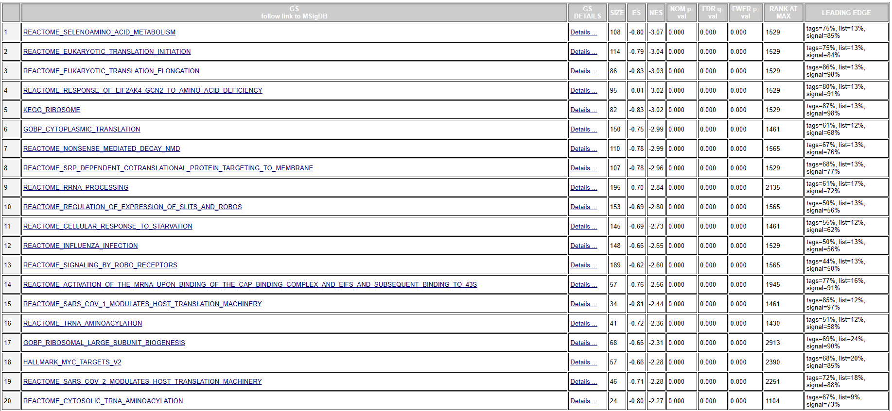
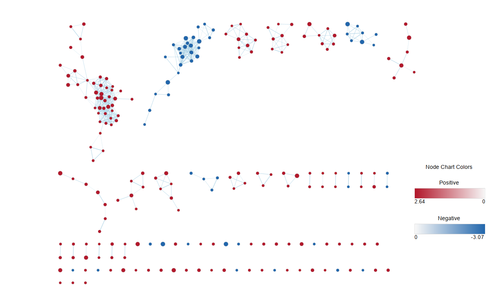
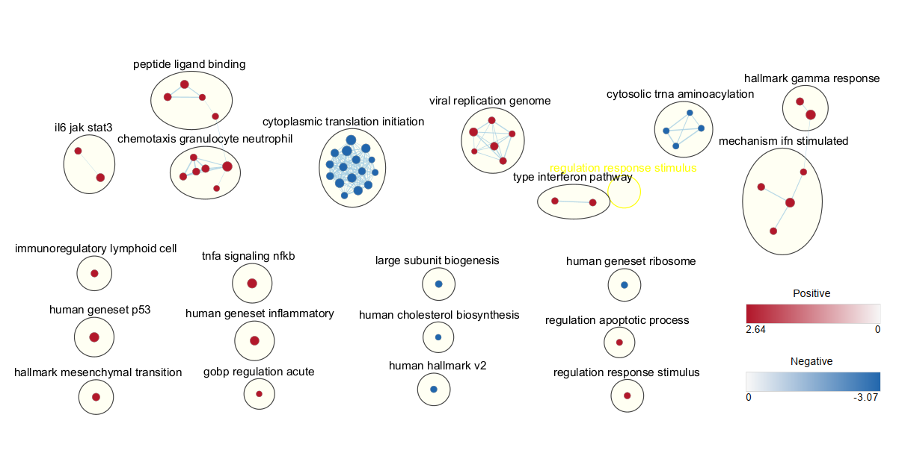
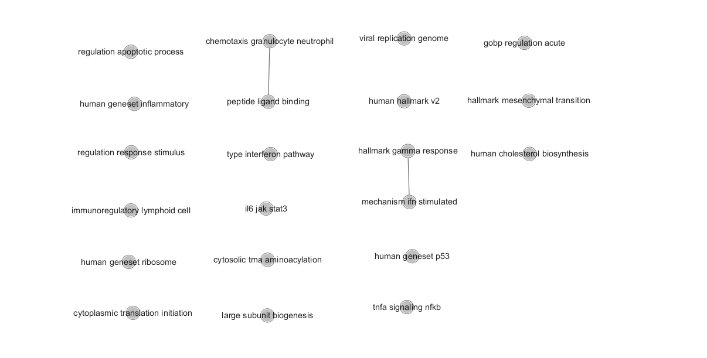
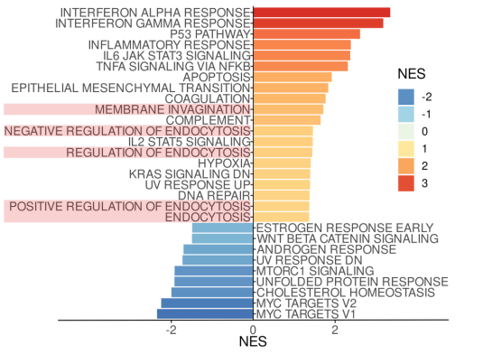

# Assignment 3 - Data set Pathway and Network Analysis

## Introduction

### Dataset Download and Cleaning

In assignment 1, we have downloaded the supplementary data of the dataset [GSE224681](https://www.ncbi.nlm.nih.gov/geo/query/acc.cgi?acc=GSE224681)[[1](https://www.frontiersin.org/articles/10.3389/fimmu.2023.1000497/full)] from GEO database.

The experiment of this dataset consists of treating tumor associated macrophages(TAMs) with cisplatin and comparing the induced expression changes with a control group. In this case, the experimental group would be TAMs that are treated with cisplatin, and the control group are TAMs that received no treatment.There are 3 replicates for each group.

In assignment 1, we have completed the pre-processing of the data, including the process of data cleaning and normalization, and the process of gene ID conversion.The initial data is a data frame of 6 columns(samples) and 63925 rows(genes).Using edgeR, we filter out any genes of total CPM < 3, which is the size of our smallest group of replicates.We filter out 50690 uninformative features, and 13235 features are left.Then we remove the Ensemble gene IDs which are not able to be mapped to the symbol IDs and map from Ensemble IDs to HUGO symbols for each feature.We merge multiple Ensemble gene IDs corresponding to one symbol ID by taking the sum.

The final data is a data frame of 6 columns and 12226 rows, with unique HUGO identifiers as rownames.

Load  the clean, normalized, and mapped dataset from Assignment 1:
```{r message=FALSE}
load("./data_preprocessing.Rdata")
```

Here are the first 10 rows of the data frame:
```{r message=FALSE}
head(mapped_data,10)
```

### Preliminary Differential Expression Analysis

In assignment 2, we have performed Preliminary Differential Expression Analysis by using DESeq2 on the clean data above. Then we extracted the genes with an adjusted p-value of < 0.05 and prepared three gene lists, all DEGs, up-regualted genes only and down-regulated genes only. We performed a thresholded ORA using g:Profiler on three gene lists and revealed some overrepresented pathways in our data.In our results of Thresholded Over-Representation Analysis, the upregulated genes are significantly enriched in p53 pathway, DNA repair pathway.The downregulated genes are significantly enriched in cholesterol metabolism related pathways. Our over-representation results support conclusions or mechanism discussed in the original paper, which identified p53 pathway, inflammatory response, IL-6 and TNFa signaling, epithelial-mesenchymal transition, endocytosis, hypoxia, KRAS signaling, DNA repair for the upregulated genes and  Myc targets, cholesterol homeostasis, mTORC1 signaling, WNTbeta-catenin signaling for the downregulated genes.

Now, load the results of DESeq2 for the next analysis:
```{r}
load("./DESeq2_results.Rdata")
```

Get an idea of the first 10 rows of DESeq2 results:
```{r}
head(DEG, 10)
```

## Non-thresholded Geneset Enrichment Analysis

In assignment 2, we extracted only the genes with a adjusted p-value < 0.05 to perform a thresholded analysis. In this assignment, we will use the full ranked gene list instead. 

I choose GSEA to complete Non-thresholded Geneset Enrichment Analysis. We need to prepare a ranked gene list by log2FoldChange.
```{r}
gene_rank <- data.frame(gene_names = rownames(DEG), rank = DEG$log2FoldChange)
gene_rank <- gene_rank[order(gene_rank$rank, decreasing = T),]
write.table(gene_rank, "ranked_genes.rnk", row.names=FALSE, sep='\t',quote=FALSE)
```


The software version of GSEA on windows is 4.3.1. First, I load the ranked genelist into GSEA. I choose following gene set databases HALLMARK, KEGG, GO:BP, and REACTOME as my annotation sources. Set `Number of permutations` at 1000 and set `Collapse/Remap to gene symbols` at `No_Collapse`. Limit gene set size to 15-200. Then run the GSEAPreranked program and get my results.

According to the results from GSEA, 2515 / 4099 gene sets are upregulated in phenotype cispaltin-treated. 582 gene sets are significant at FDR < 25%. 582 gene sets are significant at FDR < 25%. 538 gene sets are significantly enriched at nominal pvalue < 5%.

Here are top 20 pathways for cispaltin-treated phenotype:


As for non-cisplatin-treated phenotype, 1584 / 4099 gene sets are upregulated. 147 gene sets are significantly enriched at FDR < 25%. 109 gene sets are significantly enriched at nominal pvalue < 1% and 224 gene sets are significantly enriched at nominal pvalue < 5%.

Here are top 20 pathways for non-ciplatin-treated phenotype:


Based on above results, we uncover that HALLMARK_INTERFERON_ALPHA_RESPONSE is the top upregulated pathway for the cisplatin-treated phenotype, along with HALLMARK_INTERFERON_GAMMA_RESPONSE, HALLMARK_INFLAMMATORY_RESPONSE and so on. The non-cisplatin-treated phenotype shows significant enrichment for REACTOME_SELENOAMINO_ACID_METABOLISM,  HALLMARK_MYC_TARGETS_V2, 	REACTOME_SELENOAMINO_ACID_METABOLISM.


In my results of Thresholded Over-Representation Analysis in assignment 2, the upregulated genes are significantly enriched in p53 pathway, DNA repair pathway and the downregulated genes are significantly enriched in cholesterol metabolism related pathways. Comparing to the above results, we see that upregulated genes are also enriched in HALLMARK_P53_PATHWAY and downregulated genes show significant enrichment for HALLMARK_CHOLESTEROL_HOMEOSTASIS (not in top 20 pathways). We find some similarity between the two results. However, it is difficult to compare two results directly. Because we use different annotation genesets for g:Profier and GSEA.

## Visualization in Cytoscape

I use the EnrichmentMap plugin from CytoScape to visualize my GSEA results. I import the results of GSEA into EnrichmentMap. Set `FDR q-value cutoff` at 0.05, `p-value cutoff` at 1.0, `NES(GSEA only)` at `ALL`, `Data Set Edges` at `Automatic`, `Cutoff(edge similarity)` at `0.375`, `Metric` at `Jaccard+Overlap Combined`. Then build an enrichment map.

Here is the enrichment map :


The main network contains 223 nodes and 524 edges. There are so many nodes in network that we could not annotate them clearly. Then I change FDR q-value cutoff at 0.001 to remove some nodes in main network. There are 58 nodes and 161 edges left.

Then I use the following parameters of AutoAnnotate plugin from Cytoscape to annotate the network:

Cluster algorithm: MCL Cluster

Edge weight column: None

Layout network to prevent cluster overlap: TRUE

Label column: GS_DESCR

Label Algorithm: WordCloud: Adjacent Words(default)

Max words per label: 3

Minimum word occurence: 1

Adjacent word bonus: 8


Here is the annotated network:

There are 21 clusters in the annotated network.

Then I collapse my network to a theme network:


The major themes present in the network are hallmark gamma response, hallmark v2, human geneset p53, and human geneset inflammatory. They fit with the model perfectly. There is no novel pathways or themes.

## Interpretation and detailed view of results

According to the original paper, they performed gene set enrichment analysis (GSEA) for up- and downregulated genes in cisplatin condition to evaluate pathway enrichment under cisplatin treatment.They choose the following databases REACTOM, KEGG, HALLMARK, GO as the annotation databases.The interferon alpha and gamma responses were the top upregulated pathways, along with p53 pathway, inflammatory response, IL-6 and TNFa signaling, epithelial-mesenchymal transition, endocytosis, hypoxia, KRAS signaling, DNA repair. The downregulated genes showed significant enrichment for Myc targets, cholesterol homeostasis, mTORC1 signaling, WNTbeta-catenin signaling.


Comparing my results to the results in original paper, I could confirm that the enrichment results support conclusions or mechanism discussed in the original paper. The annotation databases of this assignment and thresholded methods in Assignment 2 are different. So there are some difference in the description and numbers of pathways. But the main findings are generally consistent.


Sometimes the most interesting information is the gene that has no information. In this type of pathway analysis we can only discover what we have already described previously in the literature or pathway databases. Often pathways found in one disease are applicable to other diseases so this technique can be very helpful.It is important to highlight any genes that are significantly differentially expressed in the model but are not annotated to any pathways. We refer to this set of genes as the dark matter.

Then I use a heatmap to visualize the expression of genes that are not annotated to any of the pathways returned in the enrichment analysis or any pathways in entire set of pathways used for the analysis.

```{r, warning=FALSE, message=FALSE}
if(!require("pheatmap")){
  install.packages("pheatmap")
}
if(!require("stringr")){
  install.packages("stringr")
}
if(!require("cogena")){
  BiocManager::install("cogena")
}
library(stringr)
library(pheatmap)
library(cogena)
```

First, get the significantly differentially expressed genes:
```{r}
degs <- rownames(DEG)[DEG$padj < 0.05]
length(degs)
```


Get genelist of the annatation gene sets
```{r}
gmt_file <- "./results/cisplatin_vs_nonCisplatin.GseaPreranked.1680596077885/edb/gene_sets.gmt"
ann <- cogena::gmt2list(gmt_file)

genes <- unique(as.character(unlist(ann)))
length(genes)
```

Get the genes in the pathways returned in the enrichment analysis:
```{r}
na_pos <- read.table("./results/cisplatin_vs_nonCisplatin.GseaPreranked.1680596077885/gsea_report_for_na_pos_1680596077885.tsv", header = T, sep = "\t")
na_neg <- read.table("./results/cisplatin_vs_nonCisplatin.GseaPreranked.1680596077885/gsea_report_for_na_neg_1680596077885.tsv", header = T, sep = "\t")
pathways <- rbind(na_pos, na_neg)
pathways <- pathways$NAME[pathways$FDR.q.val < 0.05]

ann_returned <- ann[names(ann) %in% pathways]
genes_ann_returned <- unique(as.character(unlist(ann_returned)))
length(genes_ann_returned)
```

Significant genes that are not annotated to any of the pathways returned in the enrichment analysis:
```{r}
dark_genes <- degs[!(degs %in% genes_ann_returned)]
length(dark_genes)
```

```{r message=FALSE, warning=FALSE}
heatmap_matrix <- t(scale(t(mapped_data[dark_genes, ])))

pheatmap(
  heatmap_matrix,
  show_rownames = T,
  show_colnames = T,
  cluster_rows = F,
  cluster_cols = T,fontsize_row = 3
)
```
<center>Figure 7 A heatmap of any significant genes that are not annotated to any of the pathways returned in the enrichment analysis.</center>

Significant genes that are not annotated to any pathways in entire set of pathways used for the analysis:
```{r}
dark_genes <- degs[!(degs %in% genes)]
length(dark_genes)
```


```{r message=FALSE, warning=FALSE}
heatmap_matrix <- t(scale(t(mapped_data[dark_genes, ])))

pheatmap(
  heatmap_matrix,
  show_rownames = T,
  show_colnames = T,
  cluster_rows = F,
  cluster_cols = T,fontsize_row = 3
)
```
<center>Figure 8 A heatmap of any significant genes that are not annotated to any pathways in entire set of pathways used for the analysis.</center>

## Reference
[1] LARIONOVA, Irina, et al. Tumor-associated macrophages respond to chemotherapy by detrimental transcriptional reprogramming and suppressing stabilin-1 mediated clearance of EGF. Frontiers in Immunology, 14: 543.

[2] Love MI, Huber W, Anders S (2014). “Moderated estimation of fold change and dispersion for RNA-seq data with DESeq2.” Genome Biology, 15, 550. doi: [10.1186/s13059-014-0550-8](https://genomebiology.biomedcentral.com/articles/10.1186/s13059-014-0550-8).

[3] Kolde R (2019). *pheatmap: Pretty Heatmaps*. R package version 1.0.12,[https://CRAN.R-project.org/package=pheatmap](https://cran.r-project.org/package=pheatmap).

[4] Subramanian A, Tamayo P, Mootha VK, et al. Gene set enrichment analysis: a knowledge-based approach for interpreting genome-wide expression profiles. Proc Natl Acad Sci U S A. 2005;102(43):15545-15550. doi:10.1073/pnas.0506580102

[5] Reimand J, Isserlin R, Voisin V, et al. Pathway enrichment analysis and visualization of omics data using g:Profiler, GSEA, Cytoscape and EnrichmentMap. Nat Protoc. 2019;14(2):482-517. doi:10.1038/s41596-018-0103-9

[6] Shannon P, Markiel A, Ozier O, et al. Cytoscape: a software environment for integrated models of biomolecular interaction networks. *Genome Res*. 2003;13(11):2498-2504. doi:10.1101/gr.1239303

[7] Merico D, Isserlin R, Stueker O, Emili A, Bader GD. Enrichment map: a network-based method for gene-set enrichment visualization and interpretation. *PLoS One*. 2010;5(11):e13984. Published 2010 Nov 15. doi:10.1371/journal.pone.0013984

[8] Kucera M, Isserlin R, Arkhangorodsky A, Bader GD. AutoAnnotate: A Cytoscape app for summarizing networks with semantic annotations. *F1000Res*. 2016;5:1717. Published 2016 Jul 15. doi:10.12688/f1000research.9090.1
